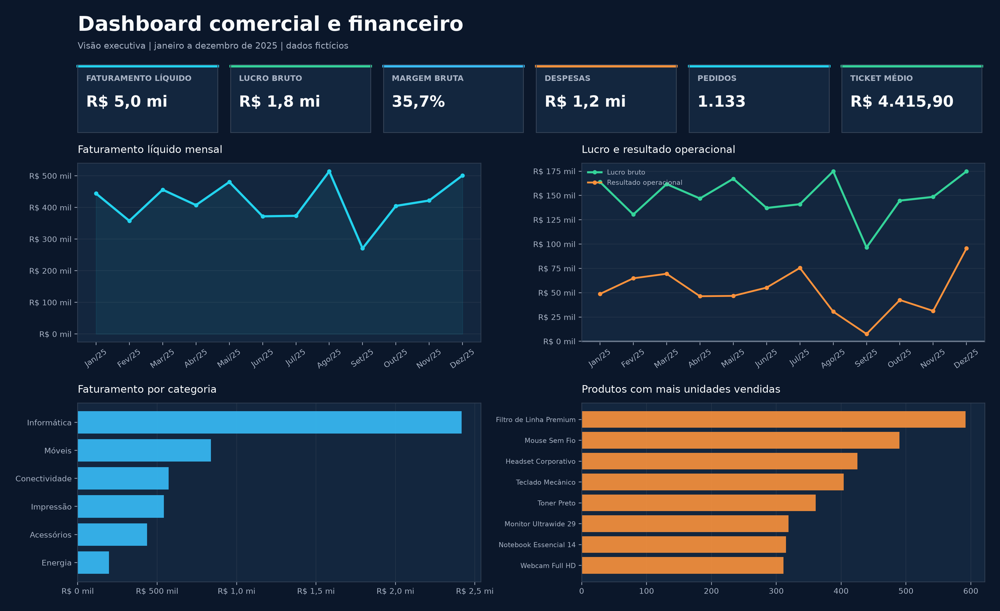
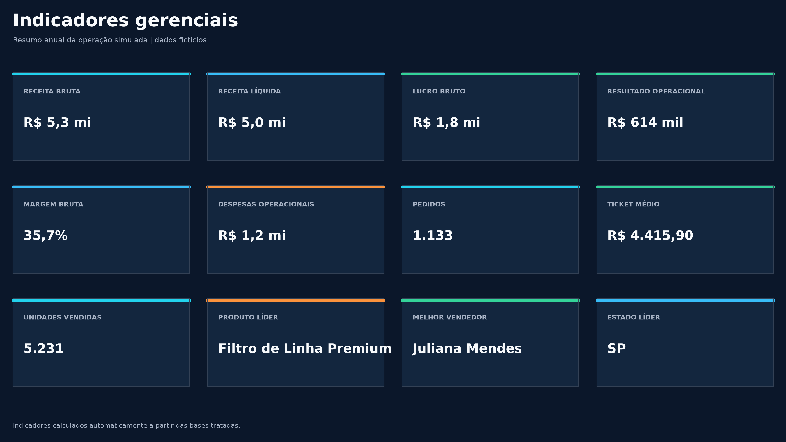
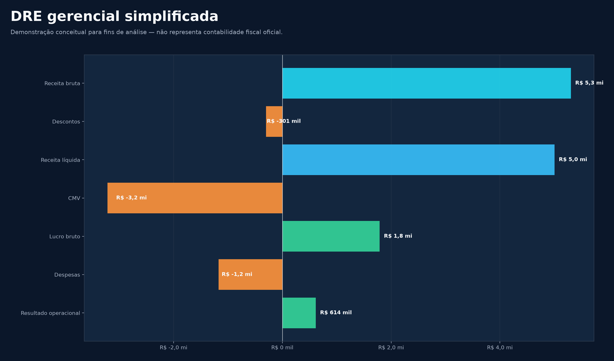
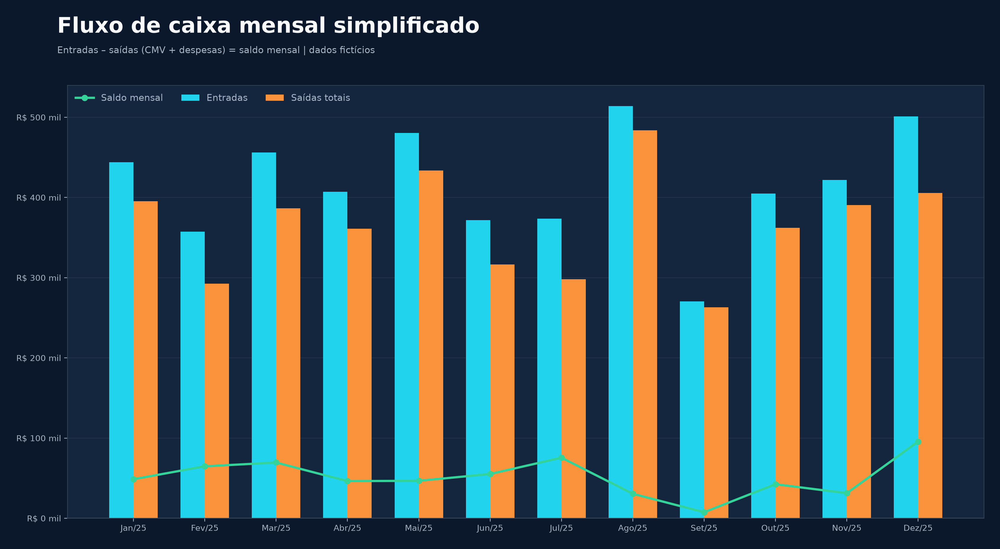
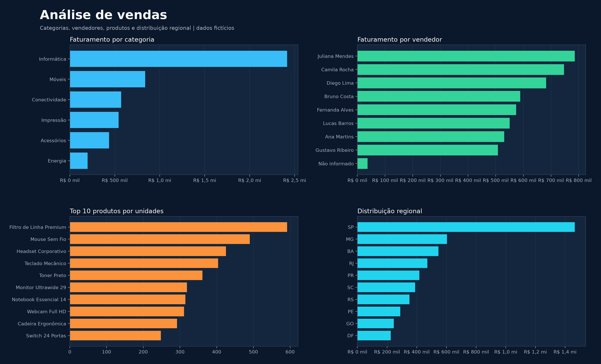

# Dashboard Comercial e Financeiro

[](https://dashboard-comercial-financeiro.streamlit.app/)

Projeto demonstrativo de análise de dados, automação de Excel e criação de dashboards desenvolvido para portfólio profissional.

> **Todos os dados utilizados são fictícios e foram gerados exclusivamente para demonstração.** Este projeto não foi desenvolvido para um cliente real.



## Visão geral

Pequenas e médias empresas frequentemente concentram vendas e despesas em planilhas preenchidas por várias pessoas. O resultado costuma incluir duplicatas, datas inválidas, campos ausentes, nomes escritos de maneiras diferentes e números armazenados como texto. Antes de analisar qualquer indicador, é preciso tornar essa base confiável.

Este projeto simula uma entrega profissional para esse cenário. Um único comando gera dados fictícios, identifica problemas de qualidade, limpa e valida as bases, calcula indicadores gerenciais e produz um pacote pronto para apresentação:

- base tratada em CSV;
- planilha Excel com sete abas;
- indicadores comerciais e financeiros;
- dashboard com gráficos nativos do Excel;
- dashboard interativo em Streamlit;
- relatório executivo em Markdown;
- cinco imagens em alta resolução para portfólio.

## Resultado visual

### Indicadores gerenciais



### DRE gerencial simplificada



### Fluxo de caixa simplificado



### Análise de vendas



## Problema simulado

A empresa fictícia precisa consolidar aproximadamente doze meses de vendas e despesas. As bases brutas contêm problemas incluídos propositalmente:

- valores ausentes;
- linhas duplicadas;
- datas em formatos diferentes e datas inválidas;
- moedas e percentuais armazenados como texto;
- quantidades acompanhadas de texto;
- variações de capitalização, acentuação e espaços;
- nomes de categorias, vendedores e formas de pagamento inconsistentes.

O objetivo é transformar esses arquivos em informações gerenciais claras, reproduzíveis e verificáveis.

## Solução

O pipeline separa cada responsabilidade em um módulo e executa as etapas na ordem abaixo:

```text
dados brutos
      ↓
validação
      ↓
limpeza
      ↓
transformação
      ↓
indicadores
      ↓
Excel
      ↓
dashboard
      ↓
relatório
```

A geração usa uma semente fixa, portanto os resultados são reproduzíveis. O processamento registra quantas duplicatas e datas inválidas foram encontradas, preenche ausências não críticas com regras explícitas e interrompe a execução se as reconciliações falharem.

## Dados gerados

A base bruta de vendas possui mais de 1.500 registros e cobre o período de janeiro a dezembro de 2025. Cada linha contém:

- data e número do pedido;
- cliente, estado e cidade;
- vendedor, produto e categoria;
- quantidade, preço unitário, desconto e custo unitário;
- forma de pagamento.

Após a limpeza, o pipeline calcula faturamento bruto, valor do desconto, faturamento líquido, custo, lucro bruto e margem percentual.

A segunda base contém despesas com data, categoria, descrição, tipo e valor. As categorias incluem aluguel, salários, marketing, logística, software, fornecedores, energia e despesas administrativas.

## Indicadores calculados

- faturamento bruto e líquido;
- descontos concedidos;
- custo das mercadorias;
- lucro bruto e margem bruta;
- despesas operacionais;
- resultado operacional simplificado;
- número de pedidos;
- ticket médio;
- unidades vendidas;
- crescimento mensal;
- produto mais vendido;
- categoria com maior faturamento;
- melhor vendedor;
- estado com maior faturamento;
- consolidação mensal de receita, custos, despesas e resultado.

## Planilha Excel

O pipeline gera `output/Dashboard_Comercial_Financeiro.xlsx` com as abas:

1. `01_Dashboard`
2. `02_Indicadores`
3. `03_Vendas`
4. `04_Despesas`
5. `05_DRE_Gerencial`
6. `06_Fluxo_Caixa`
7. `07_Resumo_Mensal`

A planilha inclui filtros, tabelas, painéis congelados, formatos de moeda, porcentagem e data, formatação condicional, larguras ajustadas, cartões de KPI e gráficos nativos do Excel. A aba de dashboard é aberta primeiro.

A demonstração de resultado segue a estrutura:

```text
Receita Bruta
(-) Descontos
= Receita Líquida
(-) Custo das Mercadorias
= Lucro Bruto
(-) Despesas Operacionais
= Resultado Operacional
```

Trata-se de uma **DRE gerencial simplificada para fins demonstrativos**. Ela não representa contabilidade fiscal oficial e não substitui demonstrações preparadas por um profissional habilitado.

## Dashboard interativo

O arquivo `app.py` disponibiliza filtros por:

- período;
- categoria;
- vendedor;
- estado.

Os filtros atualizam KPIs, evolução mensal, categorias, vendedores, produtos, regiões e fluxo mensal. As despesas são filtradas somente pelo período, pois a base de despesas não possui dimensões de produto, vendedor ou estado; o aplicativo informa essa limitação quando um filtro comercial está ativo.

## Tecnologias

- **Python** para orquestração e automação;
- **pandas** e **NumPy** para limpeza, validação, transformação e métricas;
- **openpyxl** para criação e formatação do Excel;
- **Matplotlib** para as imagens de portfólio;
- **Streamlit** e **Altair** para o dashboard interativo;
- **pytest** para testes automatizados.

## Como executar

Requisito: Python 3.10 ou superior.

### 1. Criar e ativar o ambiente virtual

Windows PowerShell:

```powershell
python -m venv .venv
.\.venv\Scripts\Activate.ps1
```

Linux ou macOS:

```bash
python -m venv .venv
source .venv/bin/activate
```

### 2. Instalar as dependências

```bash
python -m pip install -r requirements.txt
```

### 3. Executar o pipeline completo

```bash
python -m src.main
```

Esse único comando recria as bases, executa a limpeza, calcula os indicadores e gera todos os arquivos de saída.

### 4. Abrir o dashboard Streamlit

```bash
streamlit run app.py
```

### 5. Executar os testes

```bash
python -m pytest -q
```

## Estrutura do projeto

```text
dashboard-comercial-financeiro-python-excel/
├── README.md
├── LICENSE
├── requirements.txt
├── app.py
├── .streamlit/
│   └── config.toml
├── data/
│   ├── vendas_raw.csv
│   ├── despesas_raw.csv
│   ├── vendas_clean.csv
│   └── despesas_clean.csv
├── src/
│   ├── config.py
│   ├── generate_data.py
│   ├── cleaning.py
│   ├── metrics.py
│   ├── charts.py
│   ├── excel_report.py
│   ├── report.py
│   └── main.py
├── tests/
│   ├── conftest.py
│   ├── test_cleaning.py
│   └── test_metrics.py
├── output/
│   ├── Dashboard_Comercial_Financeiro.xlsx
│   └── relatorio_executivo.md
└── portfolio/
    ├── 01_dashboard.png
    ├── 02_indicadores.png
    ├── 03_dre.png
    ├── 04_fluxo_caixa.png
    └── 05_analise_vendas.png
```

## Arquivos produzidos

| Arquivo | Finalidade |
|---|---|
| `data/vendas_raw.csv` | Base fictícia de vendas com problemas intencionais |
| `data/despesas_raw.csv` | Base fictícia de despesas com problemas intencionais |
| `data/vendas_clean.csv` | Vendas limpas, validadas e enriquecidas |
| `data/despesas_clean.csv` | Despesas limpas e padronizadas |
| `output/Dashboard_Comercial_Financeiro.xlsx` | Entrega principal em Excel |
| `output/relatorio_executivo.md` | Síntese dos resultados, tendências e interpretações |
| `portfolio/*.png` | Imagens em alta resolução para apresentação profissional |

## Testes e controles

A suíte automatizada verifica:

- presença dos campos obrigatórios;
- ausência de valores nulos em campos essenciais;
- remoção de duplicatas;
- conversão e validade das datas;
- limites de quantidade, desconto, preço e despesa;
- cálculo de faturamento, custo e lucro;
- consistência entre KPIs e totais mensais;
- reconciliação da DRE gerencial;
- reconciliação do fluxo de caixa.

O próprio pipeline reabre o arquivo Excel ao final e confere a ordem das abas, a quantidade de gráficos, as linhas de dados, as fórmulas e a existência de todos os arquivos esperados.

## Serviços demonstrados neste projeto

- automação de Excel;
- tratamento de dados;
- análise de CSV/XLSX;
- dashboards;
- indicadores;
- relatórios;
- automação com Python.

## Limitações

- Os dados são inteiramente fictícios e não representam uma operação real.
- A DRE e o fluxo de caixa são simplificações gerenciais, sem finalidade fiscal.
- O projeto não inclui banco de dados, autenticação ou infraestrutura externa porque esses componentes não são necessários para demonstrar a solução.
- As análises descrevem padrões presentes nos dados; não estabelecem relações de causa e efeito.

## Sugestão de publicação

Nome do repositório: `dashboard-comercial-financeiro-python-excel`

Descrição: **Automação de Excel, análise de dados e dashboard comercial/financeiro com Python. Projeto demonstrativo de portfólio.**
